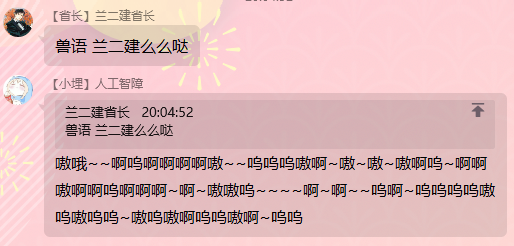
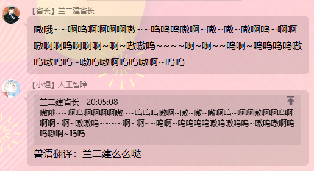

# 兽音译者（兽语翻译）SDK


**采用 `JavaScript` 、 `GoLang` 、 `Python` 、 `PHP` 多端实现。**  

可以自定义字符, 可以相互兼容，具体按照需要自行改造。  

----
## 使用

### 翻译到兽语  

#### JavaScript
```javascript
var str = encode("你好");
console.log(str);

// 呜嗷嗷嗷啊嗷嗷~啊呜~啊~呜呜嗷
```
#### PHP
```php
<?php
include('./beast.php');

$enStr = encode("你好");
echo "兽语：" . $enStr;

// 呜嗷嗷嗷啊嗷嗷~啊呜~啊~呜呜嗷
```
#### GoLang
```go
enStr := encode("你好")
fmt.Print(enStr)

// 呜嗷嗷嗷啊嗷嗷~啊呜~啊~呜呜嗷
```
#### Python
```python
print(encode("你好"))

// 呜嗷嗷嗷啊嗷嗷~啊呜~啊~呜呜嗷
```
  

### 翻译到人话

#### JavaScript
```javascript
var str = decode("呜嗷嗷嗷啊嗷嗷~啊呜~啊~呜呜嗷");
console.log(str);

// 你好
```
#### PHP
```php
<?php
include('./beast.php');

$deStr = decode("呜嗷嗷嗷啊嗷嗷~啊呜~啊~呜呜嗷");
echo '<br>音译：' . $deStr;

// 你好
```
#### GoLang
```go
deStr := decode("呜嗷嗷嗷啊嗷嗷~啊呜~啊~呜呜嗷")
fmt.Print(deStr)

// 你好 
```
#### Python
```python
print(decode("呜嗷嗷嗷啊嗷嗷~啊呜~啊~呜呜嗷"))

// 你好 
```
----
## 自定义字典：
### 修改beast数组即可~注意不能重复哦！

----
## Demo



----
## 参考
> JavaScript原版 `sgdrg15rdg/beast_js` : https://github.com/sgdrg15rdg/beast_js
> 
> Python原版 `6DDUU6/beast_python` : https://github.com/6DDUU6/beast_python